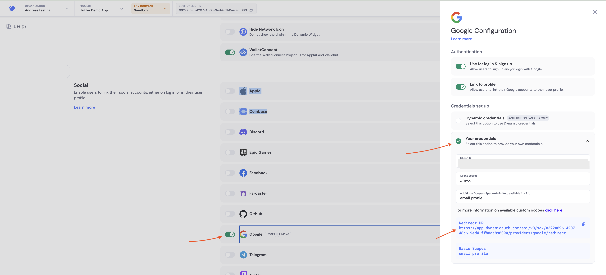
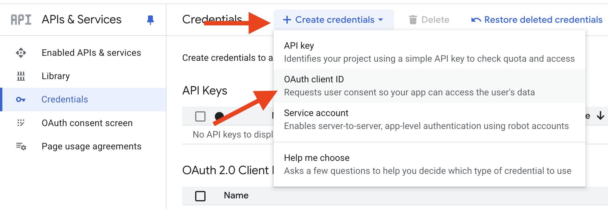
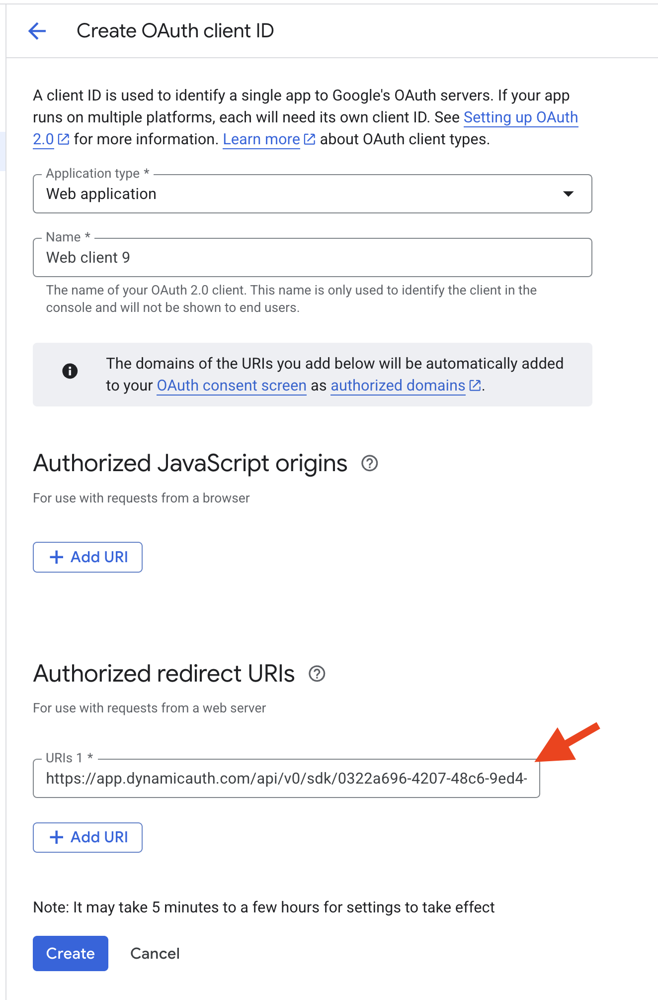
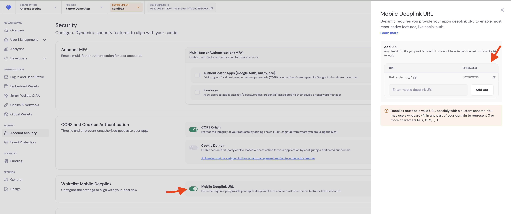

# This guide is for setting up social login in your app.

## 1. Enable social login in you Dynamic Dashboard

### 1.1. Enable Google login in the Dynamic Dashboard

- go to https://app.dynamic.xyz/dashboard/log-in-user-profile
- click on "Google"
- click on "Enable" toggle
- grap your redirect URL from the Dynamic Dashboard google section



### 1.2. Create google oauth credentials

- go to https://console.cloud.google.com/apis/credentials
- click on "Create credentials"
- select "OAuth client ID"
- select "Web application" as the Application type
- add the redirect URI from the Dynamic Dashboard google section in the "Authorized redirect URIs"
- click on "Create"
- copy the "Client ID" and "Client Secret"
- paste the "Client ID" and "Client Secret" in the Dynamic Dashboard google section
- click on "Save"




## 2 Enable deepkink in your project

### 2.1. Configure AndroidManifest.xml

You need to add a deeplink schema to the AndroidManifest.xml to enable deep link in your app.

Add the following to the AndroidManifest.xml:

```yaml
<manifest>
<application>

<activity
android:name="com.linusu.flutter_web_auth_2.CallbackActivity"
android:exported="true">
<intent-filter android:label="flutter_web_auth_2">
<action android:name="android.intent.action.VIEW" />
<category android:name="android.intent.category.DEFAULT" />
<category android:name="android.intent.category.BROWSABLE" />
<data android:scheme="YOUR_CALLBACK_URL_SCHEME_HERE" />
</intent-filter>
</activity>

</application>
</manifest>
```

Replace YOUR_CALLBACK_URL_SCHEME_HERE with the scheme you want, for example "flutterdemo"

### 2.2. Remove any 'android:taskAffinity=""' from your AndroidManifest.xml

In your AndroidManifest.xml, remove any 'android:taskAffinity=""' from the activity tag.
This prevents a bug on android where the popup does not close properly.

### 2.3. Configure your dynamic sdk to use the deep link configured

In you DynamicSDK.init call, add the redirectURL to match your scheme.

```dart
DynamicSDK.init(
  props: ClientProps(
    // Find your environment id at https://app.dynamic.xyz/dashboard/developer
    environmentId: '<YOUR_ENVIRONMENT_ID>',
    redirectUrl: "<YOUR_CALLBACK_URL_SCHEME_HERE>://",
  ),
);
```

example with flutterdemo scheme:

```dart
DynamicSDK.init(
  props: ClientProps(
    // Find your environment id at https://app.dynamic.xyz/dashboard/developer
    environmentId: '<YOUR_ENVIRONMENT_ID>',
    redirectUrl: "flutterdemo://",
  ),
);
```

## 3. Whitelist your deeplink scheme in the Dynamic Dashboard

- go to https://app.dynamic.xyz/dashboard/security
- enable "Mobile Deeplink URL"
- add your deeplink pattern to the list, for example "flutterdemo://\*"
- click on "Save"



## 4. Run your app

- run your app
- click on the "Login" button
- Select "Google"
- Google popup should appear
- Select your Google account
- You should be redirected to your app and logged in
